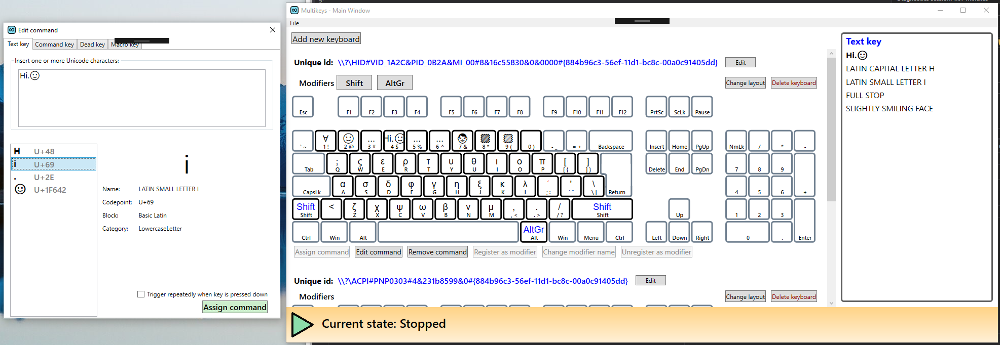

This project is unmaintained. Feel free to clone and continue development as you see fit.

# Introduction and Motivation

Custom keyboard layouts are an option to those who want to expand the functionality of their keyboards, whether to type uncommon symbols or to define custom macros.  
Many applications for creating custom layouts exist, such as [AutoHotKey][autohotkey] and [Microsoft's Keyboard Layout Creator][msklc], with varying capabilities and learning curves. However, they are not capable of remapping more than one keyboard simultaneously.  
On the other hand, the software [LuaMacros][luamacros], by Petr Medek, allows for using multiple keyboards in Windows, but does not offer custom layout functionality. It is instead focused on executing macros written in the Lua language.

The obstacle in implementing such functionality is that the Windows operating system does not allow for multiple keyboard layouts to be used at once. If more than one keyboard is connected to the computer, they all share certain states (such as CapsLock), and their layout. Additionally, a Windows program (normally) has no way of identifying which keyboard device a keystroke message came from.

Typically, keystrokes can be intercepted using either a Keyboard Hook or the RawInput API, both from the Windows API. Through a Keyboard Hook, it is possible to modify or even block a message generated by a keystroke, but the program cannot extract information about which device originated that message.

The RawInput API, on the other hand, does provide low-level information that includes the device's name. However, it is not possible to manipulate the messages received this way.

[This article][blecha on remapping] by Vít Blecha describes how to selectively block keyboard keystrokes based on which device the signal came from, showing that it should be possible for an application to treat keystrokes differently for different keyboards. That, combined with an internal model of a keyboard layout, should enable a user to effectively remap multiple keyboards using different layouts.

This application aims at providing such a solution: to allow the user to create and use multiple keyboard layouts at once in the Windows Operating System.

The user interface for this program is a Layout Editor, written in C# (with WPF), targeting the .NET framework version 4.5. Its goal is to make it easy to create and use any number of custom layouts for any purpose.

# Getting Started

This is a Visual Studio 2019 project targeting Windows 7 or higher. The core project in Visual C++ interacts with the Windows API to intercept and substitute keystrokes according to a configuration file in XML. The Layout Editor is written in C# WPF, and is used to edit configuration files that contain the layouts for the different registered keyboards; it also writes the XML configuration files and starts and stops the core application.

# Build and Run

Buiding the solution should be simple, but be sure to build the C++ projects in Release mode before building and running the Layout Editor. There are post-build actions that copy the outputs around.  
You can use the sample file at multikeys/XML/Sample.xml, either by calling the background executable with it as parameter, or by using the (unfinished) UI.

# Note

I consider the main code for the background executable to be complete, but I never got around to finishing the UI. Considering the limitation of only being able to recognize devices by port, I do not believe this project would add many features that aren't already possible to obtain with existing programs. I also never tested this program on games, which I think would be the use case for many people looking for a solution like this. Perhaps I'll go back to this project another time, but presently I have no intentions of continuing development.

[autohotkey]: https://autohotkey.com/
[msklc]: https://msdn.microsoft.com/en-us/globalization/keyboardlayouts.aspx
[blecha on remapping]: https://www.codeproject.com/Articles/716591/Combining-Raw-Input-and-keyboard-Hook-to-selective
[luamacros]: https://github.com/me2d13/luamacros
